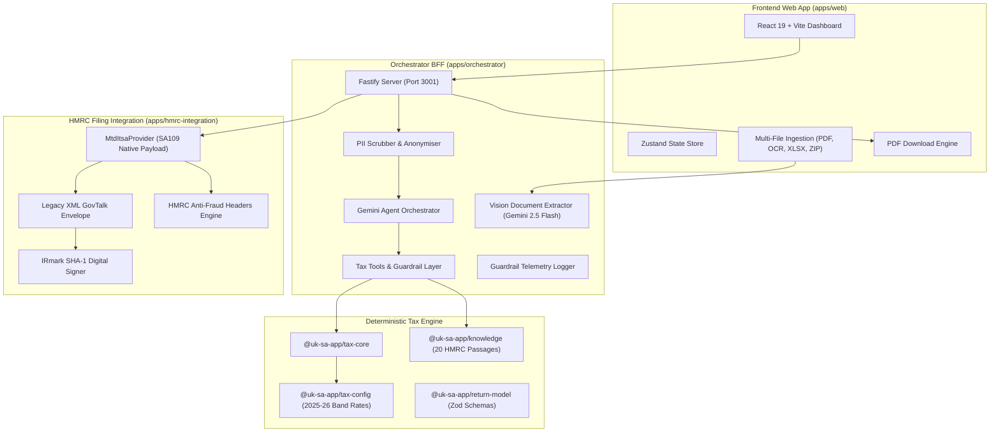

# Maneo — AI-Native UK Self Assessment Filing Platform

<div align="center">


**The AI-Native Tax Filing Engine Designed for Foreign Nationals, Expats, and Mid-Year Movers.**

[Features](#-key-features) • [Architecture](#%EF%B8%8F-architecture) • [Design Philosophy](#-ai-native-design-philosophy) • [Packages](#-monorepo-structure) • [Quickstart](#-quickstart--setup) • [CI/CD & Evals](#-cicd--agent-evaluations)

</div>

---

## 📌 Executive Summary

**Maneo** solves the critical UK tax filing gap: **HMRC's standard online portal cannot file non-resident / SA109 tax returns**, forcing foreign nationals, mid-year arrivers/leavers, and expats to either submit paper returns or pay expensive accounting firms.

Maneo provides a seamless, conversational, and vision-assisted agent interface that guides users through complex UK tax rules (Statutory Residence Test, Split-Year Treatment, Foreign Income & Gains (FIG) regime, and Capital Gains), while guaranteeing **100% mathematical precision and legal reproducibility**.

---

## 🏗️ Architecture

Maneo is built as a TypeScript monorepo operating on the **LLM Orchestrator over a Deterministic Core** pattern.



---

## 💡 AI-Native Design Philosophy

> ⚠️ **The No-AI-Arithmetic Invariant**
>
> Frontier LLMs miscalculate tax liabilities by an average of over $2,000 when performing mental math. In Maneo, **the AI agent is strictly forbidden from executing arithmetic in chat**. All tax liabilities, band allocations, Personal Allowance tapers, High Income Child Benefit Charges (HICBC), and Foreign Tax Credit Reliefs (FTCR) are computed by the deterministic `@uk-sa-app/tax-core` engine.

1. **LLM as Orchestrator**: The frontier model reads messy inputs, classifies documents, extracts structured data with confidence scores, disambiguates user intent, and asks clarifying questions.
2. **Deterministic Back-End**: Calculations run through pure TypeScript tax rules mapped 1-to-1 to HMRC manuals and validated against official HMRC reference vectors (`MTR-v1-2.xsd`).
3. **Safety & Guardrails**:
   - **Pre-LLM PII Scrubber**: Redacts names, NINOs, UTRs, sort codes, and account numbers before context leaves the server.
   - **Post-LLM Safety Net**: Verifies model responses to catch and redact hallucinated unverified figures.
   - **Human Escalation Path**: Triggers first-class human support handoff for complex, high-value, or ambiguous tax edge cases.

---

## ✨ Key Features

- **SA100 Main Return**: Full PAYE reconciliation, UK savings interest, UK dividends, Gift Aid grossing, and relievable pension contributions.
- **SA102 Employment Income**: P60/P45/P11D multi-employer tracking, benefits-in-kind, professional expenses.
- **SA106 Foreign Income & FTCR**: DTA treaty rate capping (e.g. US/India 15% dividend caps), country-by-country foreign tax credit relief calculation.
- **SA108 Capital Gains**: Listed shares, Section 104 share pooling, 30-day bed-and-breakfast matching, property disposal PRR, crypto disposals, and BADR claims.
- **SA109 Residence & FIG Regime**:
  - Statutory Residence Test (SRT) day counter & tie-breaker evaluation.
  - Split-Year Treatment (Cases 1–8).
  - Post-6 April 2025 Foreign Income & Gains (FIG) 4-year exemption election with automatic trade-off analysis (surrender of Personal Allowance & AEA).
  - Overseas Workday Relief (OWR) tracking.
- **📄 Final Tax Return PDF Export**: Instant generation of official-styled SA100/SA102/SA106/SA108/SA109 Tax Return & Calculation Summaries with IRmark proof.
- **📁 Multi-File & Multi-Format Ingestion**: Drag-and-drop support for single/batch upload of images (OCR), PDFs, XLSX/CSV transaction logs, and ZIP archives.

---

## 📦 Monorepo Structure

```
.
├── apps/
│   ├── web/                # React 19 + Vite frontend application
│   ├── orchestrator/       # Fastify BFF, Gemini agent harness, & PII scrubber
│   └── hmrc-integration/   # HMRC MTD ITSA REST & GovTalk SOAP XML providers
├── packages/
│   ├── tax-core/           # Deterministic tax calculation & assembler engine
│   ├── tax-config/         # Tax year configuration tokens (2025-26 rates & bands)
│   ├── return-model/       # Zod domain schemas for SA100-SA109
│   ├── knowledge/          # HMRC guidance passages & DTA treaty database
│   └── hmrc-artefacts/     # HMRC official schemas (MTR-v1-2.xsd) & reference fixtures
├── cloudbuild.yaml         # Google Cloud Build CI/CD pipeline
└── .github/workflows/      # GitHub Actions CI/CD workflow
```

---

## ⚡ Quickstart & Setup

### Prerequisites
- **Node.js**: v20.x or higher
- **npm**: v10.x or higher
- **Google Cloud Platform Project**: (for Vertex AI Gemini access)

### 1. Clone & Install
```bash
git clone https://github.com/rahulbabbar1/maneo.git
cd maneo
npm install
```

### 2. Configure Environment Variables
Create an `.env` file in `apps/orchestrator`:
```env
PORT=3001
GCP_PROJECT=uk-self-assessment
GCP_REGION=europe-west2
HMRC_VENDOR_LICENSE_SECRET=your-sandbox-secret
ALLOWED_ORIGINS=http://localhost:5173,http://localhost:3000
```

### 3. Build Monorepo
```bash
npm run build
```

### 4. Run Development Server
```bash
npm run dev
```
The React Web UI will be available at `http://localhost:5173` and the BFF Orchestrator at `http://localhost:3001`.

---

## 🧪 CI/CD & Agent Evaluations

Maneo includes a **19-scenario automated Agent Evaluation Harness** (`eval-agent.ts`) that runs on every pull request and deployment:

```bash
npm run eval --workspace @uk-sa-app/orchestrator
```

### Continuous Integration Pipeline
Our automated CI/CD pipeline (`cloudbuild.yaml` and `.github/workflows/ci-cd.yml`):
1. Runs workspace linting and TypeScript compilation.
2. Executes deterministic unit tests across all 5 core packages.
3. Executes the **live online Agent Evaluation Suite** against Vertex AI.
4. Validates XML outputs against official HMRC XSD schemas (`MTR-v1-2.xsd`).
5. Builds and deploys the container image to **Google Cloud Run**.
6. Performs automated post-deployment online health checks.

---

## ⚖️ Compliance & Disclaimer

*Maneo is a financial technology software platform. Tax calculations are generated using deterministic rules based on published HMRC guidelines for the 2025-26 tax year. Live submissions to HMRC require user confirmation and authenticated credentials.*

---

<div align="center">
  <sub>Built with ❤️ for UK Foreign Nationals & Expats.</sub>
</div>
